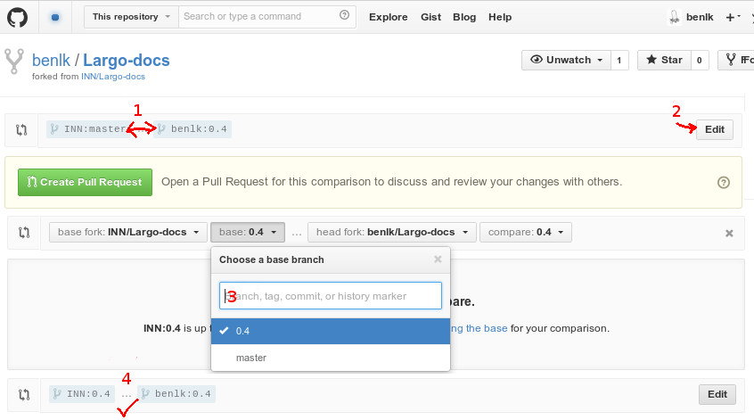

# Largo Documentation

This repository contains the wiki for the development version of [INN/Largo](https://github.com/INN/Largo/tree/develop). **This is a work in progress**. 

For stable documentation about the [stable branch](https://github.com/INN/Largo/tree/master), see [largoproject.org](http://largoproject.org/).

For guides on contributing to this wiki, see [Contributing-to-this-wiki.md](Contributing-to-this-wiki.md).

For a list of areas that need contribution, see [TODO.md](TODO.md)

## Branching

Each release of Largo (0.3, 0.4, etc) will have a branch of Largo-docs named after that branch. 

### Submitting pull requests

Make sure that your pull request is submitted to the correct branch of the Largo-docs repository: 

Include a description of your changes in your pull request. 

## Updating the INN/Largo wiki

This requires you to be in a team with push access to INN/Largo.

When a new Largo release is out, merge that release's branch with the Largo-docs master branch on GitHub. Then, make sure you're on the Largo-docs `master` branch:

	git fetch Largo-docs
	git checkout Largo-docs/master

Then:

    git remote add wiki git@github.com:INN/Largo.wiki.git
    git push -u wiki master
