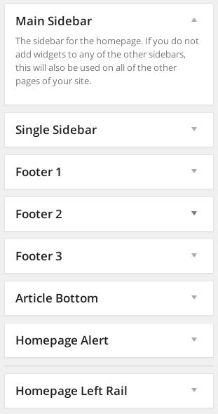

## Sidebars and widget areas:

The Largo theme has built in support for three sidebars and two footer widget areas. 

Access and edit the these widget areas from the Appearance &gt; Widgets menu in the left sidebar of the WordPress admin interface.

- **Main Sidebar**: used on the homepage as well as on archive, author and search results pages.
- **Single Sidebar**: used for single posts and pages.
- **Topic** (Conditional Home Page Options > Sidebars): 
- **Footer 1, 2, and 3**: The first, second and third widget areas in the footer. If you have chosen a four-column footer layout in *Dashboard &gt; Appearance &gt; Theme Options &gt; Layout Options &gt; Footer Layout*, then a fourth area will be available, called "Footer 4."
- **Article Bottom**: Appears at the bottom of all posts. 
- **Homepage Alert**: 
- **Header Ad Zone**: 
- **Homepage Left Rail**: An optional widget area that, when enabled, appears to the left of the main content area on the homepage

To add widgets to any of these areas, simply drag and drop a widget from the area on left to the widget area you want it to appear in. Note that as soon as you add any widgets to a widget area, the default will no longer display so you will need to completely populate the widget area with the widgets you want to display. Many widgets will have additional settings you can use to configure how they appear on your site.

## Widgets

The Largo theme includes a number of custom widgets we developed to ensure compatibility and consistent display.

- **Footer Featured Posts**: 
- **INN Member Stories**: An RSS feed of recent stories from INN members
- **Largo Recent Posts**: 
- **Largo About Site**: Show the site description from your theme options page
- **Largo Author Bio**: Show the author bio in a widget
- **Largo Disclaimer Site**: Show the article disclaimer
- **Largo Donate Widget**: Call-to-action for donations
- **Largo Explore Related**: A fancy tabbed interface showing posts related to the current post; formerly a theme option.
- **Largo Facebook Widget**: Show a Facebook Like Box for your page
- **Largo Featured Posts**: Show recent featured posts with thumbnails and excerpts
- **Largo Follow**: Display links to social media sites set in Largo theme options
- ~~Largo Footer Featured Posts~~: **Deprecated**: Show recent featured posts with thumbnails and excerpts
- **Largo Post Series Links**: Shows the titles/descriptions of the series the post belongs to.
- **Largo Prev/Next Links**: Prev/next post navigation, typically at the bottom of single posts; formerly a theme option.
- **Largo Recent Comments**: Show recent comments
- **Largo Recent Posts**: Show your most recent posts with thumbnails and excerpts
- **Largo Related Posts**: Lists posts related to the current post
- **Largo Series Posts**: Lists posts in the given series
- ~~Largo Sidebar Featured Posts~~: **Deprecated**: Show recent featured posts with thumbnails and excerpts
- **Largo Tag List**: A list of tags for the current post; formerly a theme option.
- **Largo Taxonomy List**: List all of the terms in a custom taxonomy with links
- **Largo Twitter Widget**: Show a Twitter profile, list or search widget

For more about widgets and how WordPress handles them, see [the WordPress Codex article on widgets](http://codex.wordpress.org/WordPress_Widgets)
